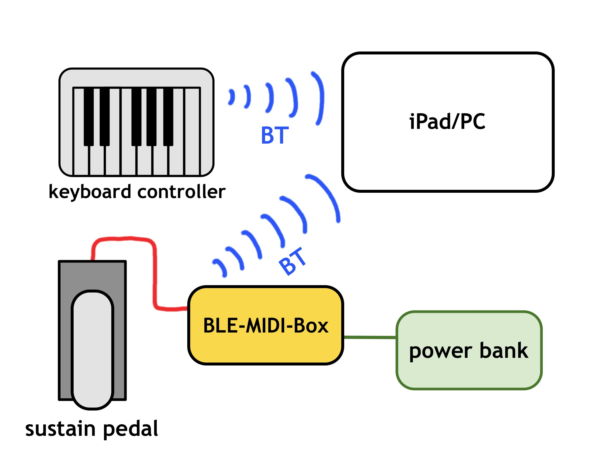
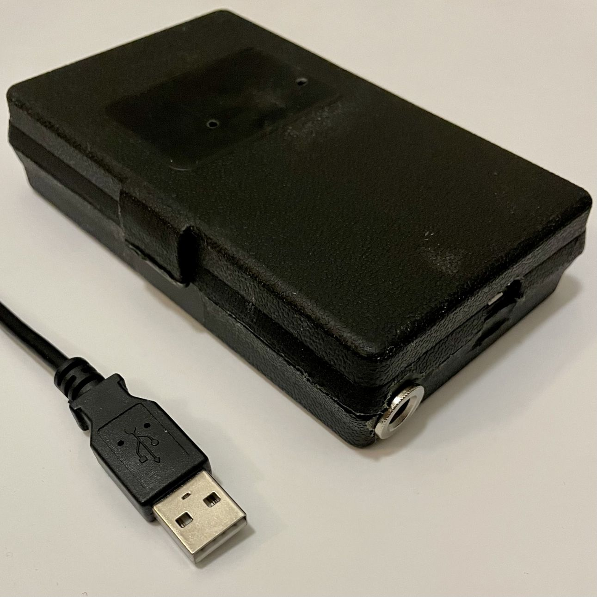
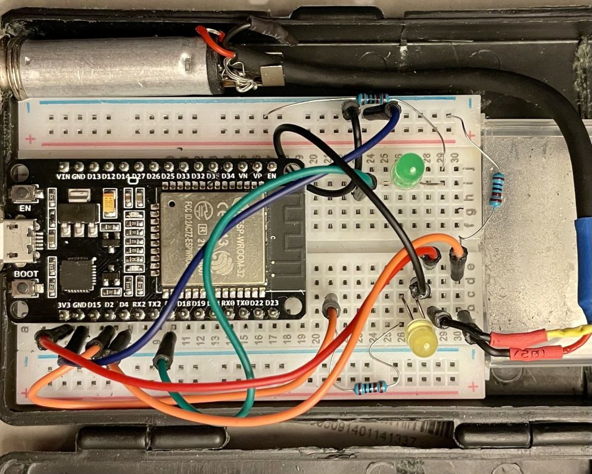

# BLE-sustain-pedal

Bluetooth MIDI sustain pedal device, any sustain pedal with 6.5mm jack can plug into.

## Why to use

Some exceptional bluetooth MIDI keyboard controllers, such as:
- [CME Xkey Air](https://xkeyair.com/xkey-air/)
- [Roli Seaboard Block](https://roli.com/products/blocks/seaboard-block-studio-edition)
- [Roli Lumi](https://roli.com/products/blocks/lumi-keys-studio-edition)

lack dedicated sustain pedal port.

BLE-sustain-pedal solves this issue by sending its own sustain pedal MIDI message via separate bluetooth connection. 

BLE-sustain-pedal works with most sustain pedals with 6.5mm jack connector.

## How it works

## Current features

### Sustain pedal

- pedal polarity auto detection
- only switch mode support

__Note__: While BT pairing is in progress, be sure the sustain pedal is both attached and not pressed, so the pedal polarity is recognized properly.

## Real device picture

## Inside the box

## Hardware list

- [ESP-WROOM-32 DevKit V1][ESP] or similar
- LED diodes (2x)
- Resistors 1kOhm (3x)
- Wires (6x)
- female jack 6.5mm
- [breadboard](https://en.wikipedia.org/wiki/Breadboard)

## Software

- [Arduino IDE](https://www.arduino.cc/en/software)
- [Arduino-BLE-MIDI](https://github.com/lathoub/Arduino-BLE-MIDI) library

## Useful links

- [ESP32 USB driver installation](https://techexplorations.com/guides/esp32/begin/cp21xxx/)
- [On slow ESP32 compilation in Arduino IDE (mid 2021)](https://arduino.stackexchange.com/questions/8559/compiling-is-slow)

<!-- References -->

[ESP]: https://www.espressif.com/en/products/modules/esp32