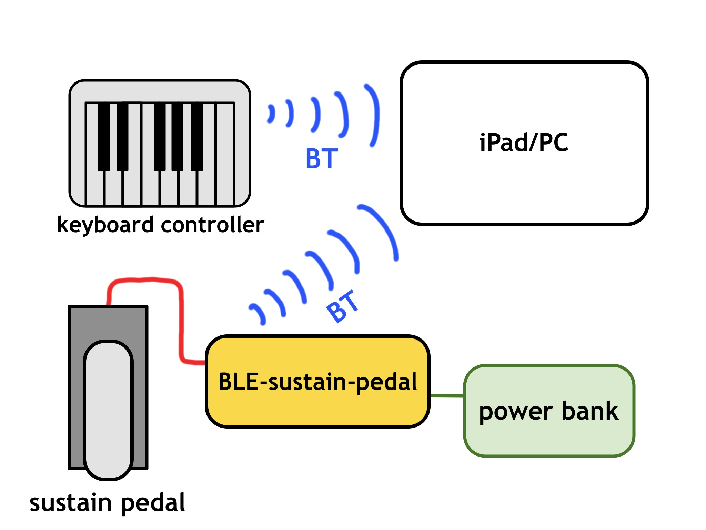

# BLE-sustain-pedal

Bluetooth MIDI sustain pedal adapter. Any sustain pedal with 6.5mm jack can plug into.

## Why to use

Some exceptional bluetooth MIDI keyboard controllers, such as:

- [CME Xkey Air](https://xkeyair.com/xkey-air/)
- [Roli Seaboard Block](https://roli.com/products/blocks/seaboard-block-studio-edition)
- [Roli Lumi](https://roli.com/products/blocks/lumi-keys-studio-edition)

lack dedicated sustain pedal port.

To solve this issue, plug any 6.5mm jack sustain pedal to the BLE-sustain-pedal adapter instead. It periodically checks pedal on/off status and sends appropriate sustain pedal MIDI message via its bluetooth connection.

## Features

- Pedal polarity auto detection.
- Power/Bluetooth and Pedal-On LED indicators.
- Powered by micro USB cable, 5W.

[User Guide](#ble-sustain-pedal-user-guide)

---

## How it works

## Real device picture

The housing is utilized micro screwdriver tool box.

## Inside the box

## Hardware list

- [ESP-WROOM-32 DevKit V1][ESP] or similar
- LED diodes (2x)
- Resistors 1kOhm (3x)
- Wires (6x)
- Female jack 6.5mm
- [Breadboard](https://en.wikipedia.org/wiki/Breadboard)
- Suitable housing

## Software

- [Arduino IDE](https://www.arduino.cc/en/software)
- [Arduino-BLE-MIDI](https://github.com/lathoub/Arduino-BLE-MIDI) library

## Useful links

- [ESP32 USB driver installation](https://techexplorations.com/guides/esp32/begin/cp21xxx/)
- [On slow ESP32 compilation in Arduino IDE (mid 2021)](https://arduino.stackexchange.com/questions/8559/compiling-is-slow)

<!-- References -->

[ESP]: https://www.espressif.com/en/products/modules/esp32

---

## BLE-sustain-pedal User Guide

1. Plug a sustain pedal to the 6.5mm connector of BLE-sustain-pedal device.
2. Power the BLE-sustain-pedal on by attaching the micro USB cable connected to a power bank or wall adaptor.
3. The pairing LED starts blinking, waiting to be connected. In the bluetooth device list, BLE-midi-pedal has a rather generic bluetooth id, such as `4F41CA98-0...`. Pair it in your tablet or other device.
4. After BLE-sustain-pedal is connected successfuly, Pairing LED lights continuosly.
5. The BLE-sustain-pedal device is ready. A pedal status LED lights whenever the attached sustain pedal is pressed.

__Notes__:

- By default, BLE-sustain-pedal sends pedal message on MIDI channel 1.
- While BT pairing is in progress, be sure the sustain pedal is both attached and not pressed, so the pedal polarity is recognized properly.
- Only switch mode pedal is supported. Continuous pedals may not work with BLE-sustain-pedal.
- if the pairing LED is not blinking after power on, unplug the micro USB cable and attach the cable again.
